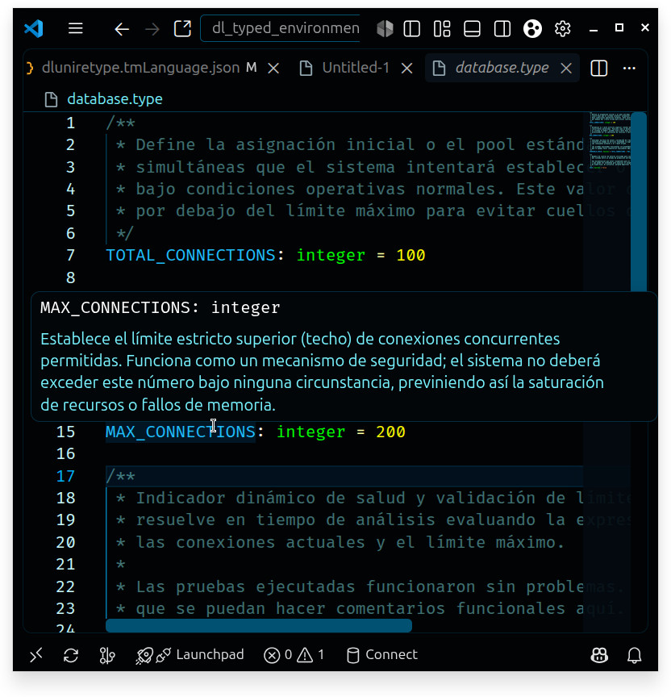

# DL Typed Environment

**Static type definitions, real-time semantic linting, IntelliSense, and tooling for environment and configuration files in Visual Studio Code.**



---

[English](#english) | [Español](#español)

---

<a name="english"></a>

## English

**DL Typed Environment** transforms standard environment and configuration files into strongly typed, statically validated declarations. It eliminates runtime configuration bugs by validating types, syntax, variable references, and arithmetic/comparison expressions directly inside Visual Studio Code.

### Key Features

* **Real-Time Semantic Linter & Diagnostics:** Instant error reporting for undeclared variables, type mismatches, duplicate declarations, and malformed expressions.
* **IntelliSense & Autocompletion:** Instant type suggestions and documentation triggered immediately upon typing `:`.
* **Rich Syntax Highlighting:** Fine-grained TextMate grammar with standard scopes and dedicated `dlunire.*` tokens for custom theme styling.
* **Expressions & Variable References:**
  * **Arithmetic Expressions:** Evaluate numeric variables and literals (`+`, `-`, `*`, `/`) across `integer`, `float`, and `numeric` types.
  * **Comparison Expressions:** Evaluate logical relations (`<`, `>`) resolving to `boolean`.
* **Hover Documentation:** Full support for JSDoc / PHPDocumentor-style docblocks (`/** ... */`), displaying rich Markdown tooltips when hovering over variables.
* **Automatic Document Formatter:** Format files on demand (`Shift + Alt + F`) or on save, normalizing declaration spacing, assignment alignment, and docblock structure.
* **JSDoc Auto-Spacing:** Automatic cursor centering when opening `/** ... */` comment blocks.
* **Supported File Extensions:** `.type`, `.type.example`, `.env.type`, `.env.type.example`.

---

### Supported Types

| Type | Description | Example |
| :--- | :--- | :--- |
| **`string`** | Text string delimited by single quotes, double quotes, or backticks. | `APP_NAME: string = "DLUnire"` |
| **`integer`** | Signed whole integer without decimals. | `PORT: integer = 8080` |
| **`float`** | Floating-point decimal number. | `RATE: float = 0.75` |
| **`numeric`** | Generic number accepting both integer and floating-point values. | `LIMIT: numeric = 100` |
| **`boolean`** | Logical boolean value (`true`, `false`) or comparison expression. | `DEBUG: boolean = false` |
| **`uuid`** | Standard RFC 4122 UUID written without quotes. | `SERVICE_ID: uuid = 3fa85f64-5717-4562-b3fc-2c963f66afa6` |
| **`email`** | Valid email address written without quotes. | `ADMIN_EMAIL: email = admin@dlunire.dev` |

---

### Syntax & Examples

```type
/**
 * Application name and operating environment.
 */
APP_NAME: string = "DLUnire Core"
APP_ENV: string = 'production'

/**
 * Server connection pooling and scaling limits.
 */
BASE_CONNECTIONS: integer = 50
MAX_CONNECTIONS: integer = BASE_CONNECTIONS * 2

/**
 * Health check threshold dynamically verified at parse time.
 */
HEALTH_CHECK_OK: boolean = BASE_CONNECTIONS < MAX_CONNECTIONS

/**
 * Service identifier and contact administrator.
 */
INSTANCE_UUID: uuid = 7b4e3f12-98ab-4cd2-b0ef-56789abcdef0
CONTACT_EMAIL: email = support@dlunire.dev
```

---

### Installation

1. Open **Extensions** in VS Code (`Ctrl + Shift + X`).
2. Search for **DL Typed Environment** (`dlunire-envtype`).
3. Click **Install**.
4. Open or create any `.type` or `.env.type` file.

---

### Repository & Support

* **Website:** [https://dlunire.dev](https://dlunire.dev)
* **Source Code:** [https://github.com/dlunire/dl_typed_environment](https://github.com/dlunire/dl_typed_environment)
* **Issues & Feedback:** [https://github.com/dlunire/dl_typed_environment/issues](https://github.com/dlunire/dl_typed_environment/issues)

**License:** MIT · **Publisher:** [dlunire](https://dlunire.dev)

---
---

<a name="español"></a>

## Español

**DL Typed Environment** transforma los archivos estándar de variables de entorno y configuración en declaraciones fuertemente tipadas y validadas estáticamente. Previene errores de configuración en tiempo de ejecución validando tipos, sintaxis, referencias cruzadas y expresiones aritméticas/lógicas directamente dentro de Visual Studio Code.

### Características Principales

* **Linter Semántico y Diagnósticos en Tiempo Real:** Detección instantánea de variables no declaradas, incompatibilidad de tipos, redeclaraciones y sintaxis malformada.
* **IntelliSense y Autocompletado:** Sugerencias automáticas de tipos primitivos con documentación integrada al escribir `:`.
* **Resaltado de Sintaxis Avanzado:** Gramática TextMate detallada con scopes estándar y tokens dedicados `dlunire.*` para integración perfecta con temas de color.
* **Expresiones y Referencias entre Variables:**
  * **Expresiones Aritméticas:** Operaciones matemáticas (`+`, `-`, `*`, `/`) entre variables y literales de tipo `integer`, `float` y `numeric`.
  * **Expresiones de Comparación:** Evaluación de relaciones lógicas (`<`, `>`) que producen valores de tipo `boolean`.
* **Documentación en Hover:** Soporte para bloques de documentación estilo JSDoc / PHPDocumentor (`/** ... */`), mostrando tooltips enriquecidos en Markdown al pasar el cursor sobre las variables.
* **Formateador Automático de Código:** Alineación y espaciado consistente a demanda (`Shift + Alt + F`) o al guardar (*Format on Save*), normalizando declaraciones y comentarios de bloque.
* **Auto-Espaciado JSDoc:** Centrado automático del cursor al abrir bloques `/** ... */`.
* **Extensiones de Archivo Compatibles:** `.type`, `.type.example`, `.env.type`, `.env.type.example`.

---

### Tipos Soportados

| Tipo | Descripción | Ejemplo |
| :--- | :--- | :--- |
| **`string`** | Cadena de texto delimitada por comillas simples, dobles o backticks. | `APP_NAME: string = "DLUnire"` |
| **`integer`** | Número entero con signo, sin decimales. | `PORT: integer = 8080` |
| **`float`** | Número con punto flotante (decimales). | `RATE: float = 0.75` |
| **`numeric`** | Número genérico que acepta tanto enteros como decimales. | `LIMIT: numeric = 100` |
| **`boolean`** | Valor lógico (`true`, `false`) o resultado de comparación. | `DEBUG: boolean = false` |
| **`uuid`** | Identificador Único Universal estándar RFC 4122 (sin comillas). | `SERVICE_ID: uuid = 3fa85f64-5717-4562-b3fc-2c963f66afa6` |
| **`email`** | Dirección de correo electrónico válida (sin comillas). | `ADMIN_EMAIL: email = admin@dlunire.dev` |

---

### Sintaxis y Ejemplos

```type
/**
 * Nombre de la aplicación y entorno de ejecución.
 */
APP_NAME: string = "DLUnire Core"
APP_ENV: string = 'production'

/**
 * Configuración del pool de conexiones a base de datos.
 */
BASE_CONNECTIONS: integer = 50
MAX_CONNECTIONS: integer = BASE_CONNECTIONS * 2

/**
 * Verificación de umbral evaluada estáticamente.
 */
HEALTH_CHECK_OK: boolean = BASE_CONNECTIONS < MAX_CONNECTIONS

/**
 * Identificador de instancia y correo de soporte.
 */
INSTANCE_UUID: uuid = 7b4e3f12-98ab-4cd2-b0ef-56789abcdef0
CONTACT_EMAIL: email = support@dlunire.dev
```

---

### Instalación

1. Abre **Extensiones** en VS Code (`Ctrl + Shift + X`).
2. Busca **DL Typed Environment** (`dlunire-envtype`).
3. Haz clic en **Instalar**.
4. Abre o crea cualquier archivo `.type` o `.env.type`.

---

### Repositorio y Soporte

* **Sitio web:** [https://dlunire.dev](https://dlunire.dev)
* **Código Fuente:** [https://github.com/dlunire/dl_typed_environment](https://github.com/dlunire/dl_typed_environment)
* **Reporte de Problemas:** [https://github.com/dlunire/dl_typed_environment/issues](https://github.com/dlunire/dl_typed_environment/issues)

**Licencia:** MIT · **Publicador:** [dlunire](https://dlunire.dev)
